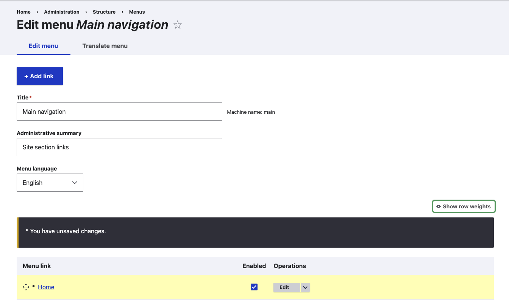

# Plan
1. Listed information 2. List of pages and page variants 3. Layout Sketches  
### What tools are available for managing workflows?
1. Published/Unpublished status 2. Revision tracking 修订跟踪 3. Workflows 工作流程 4. Block placement 模块
### What languages does the software support?
the core Language module installed in order to use a language other than English on the site

# Installation
### What are the requirements for running the core software?
1. Disk space
2. PHP 7.3 or a higher PHP 7 version，Certain PHP extensions are also required; If you are self-hosting or running your site on your local computer, you will get error messages during installation if any required PHP extensions are missing, and should be able to install them and continue.
3. Web server: Apache, PHP Local Server, Nginx, Microsoft IIS
4. Database: MySQL, PostgreSQL, SQLite 
### (?)What tools are available for site builders? 
1. Drush and Drupal Console (Drupal benutzt): 
```drush
    cex //exportieren wie git push
    cim //importieren wie git pull
    commit //wie git commit .
```
2. Git
3. Composer(wie npm)
4. Devel (?)
### What are command-line tools? 命令行
The most popular tools are Drush and Drupal Console.
1.  install Composer first in order to install either the Drush or Drupal Console tool.
```
composer require drush/drush  //Install Drush

composer require drupal/console:~1.0 --prefer-dist --optimize-autoloader  //Install Drupal Console
```
### What is a version control system? 什么是版本控制系统？
 Git
 many software projects and individuals host their Git repositories using third-party services provided by GitLab or GitHub.
### What is Composer used for?
Composer is a tool for managing PHP dependencies, where the developer specifies what version of each external library is needed, and Composer manages the process of downloading and installing the libraries.
Composer 是一个管理 PHP 依赖项的工具，开发人员在其中指定每个外部库需要的版本，而 Composer 管理下载和安装库的过程.
To install a module with external dependencies, you will need to run Composer.
### What tools are available for module and theme developers?
1. Drupal Console: Drupal Console 是一个命令行工具，可以生成样板代码并与 Drupal 站点交互。例如，它可以生成块或形成代码、安装模块和主题以及创建虚拟内容。 Drupal 控制台使用 Symfony 控制台。
2. Coder: Coder 是一个命令行工具，用于检查您的模块和主题是否符合编码标准和其他最佳实践。它还可以修复违反编码标准的问题。(wie eslint)
3. Browser debugging tools
# Installieren
### Use Composer for complicated dependencies
### install the core software
1. 安装核心软件意味着设置一些数据库表、配置和管理用户帐户，以便您可以构建和使用您的站点。
2. Get Drupal with Composer
```php
composer create-project drupal/recommended-project drupal 
cd drupal 
php web/core/scripts/drupal quick-start demo_umami
``` 
#### Fehler Ps 
 https://gitlab.ueberbit.de/ueberbit/mac-dev-playbook/-/wikis/php/php#php

 Die Default-File für die Konfiguration ALLER installierten PHP Versionen liegt unter ~/.config/php/default.ini. man muss anlegen.

```
; General settings
memory_limit = -1
post_max_size = 50M
upload_max_filesize = 50M
max_execution_time = 300
max_input_vars = 10000
display_startup_errors = On
error_reporting = -1

[date]
date.timezone = "Europe/Berlin"

[xdebug]
xdebug.mode = develop,debug
xdebug.start_with_request = yes
xdebug.max_nesting_level = 3000

```


# Basic Site Configuration

### Basic Site Configuration
- Content 内容
列出和管理现有内容，并允许创建新内容。
- Structure 结构
包含用于管理站点结构元素的链接列表，例如块、内容类型、菜单和分类。
- Appearance 样式
- Extend
管理模块的安装和卸载。
- Configuration 配置
Contains links to settings pages for various site features. 包含指向各种站点功能的设置页面的链接。
- People
管理用户、角色和权限。
- Reports
Contains links to logs, update information, search information, and other information about the site’s status.
- Help

### Editing Basic Site Information
    Configuration > System > Basic site settings 
    增加语言：访问语言配置页面 “Configuration > Regional and language > Languages” 

### Install und Uninstall Model

1. Using the administrative interface
 Extend 
2. Using Drush
```
drush pm:enable tracker
```
```
drush pm:uninstall tracker
```
### Configuring User Account Settings
Configuration > People > Account settings 
### Configuring the Theme
Appearance > Settings
# Basic Page Management
### Concept: Paths, Aliases, and URLs
- What is a URL?
网页在 Web 上的地址

- What is a Path?

路径是特定功能或内容的 URL 的唯一的最后部分。例如，对于完整 URL 为 http://example.com/node/7 的页面，路径为 node/7。

- What is an Alias? 别名. 
如果您有一个路径为 node/7 的“关于我们”页面，您可以设置一个别名，以便您的访问者将其视为 http://www.example.com/AboutUs。

### Creating a Content Item
- Content > Add content > Basic page 
- Click Edit summary.
- Fill Title, Summary, Body, URL path settings > URL alias(z.B. /home)
- Click Preview 
- Click Back to content editing.
- Click Save and publish. The content is saved and can be found on the Content page.

### Adding a Page to the Navigation
- Content (admin/content)
- Edit 
- Menu settings
- Provide a menu link 
- Enter values: 
    Menu, 
    link(Parent link...), 
    Weight:页面在菜单中的显示顺序（权重较低的菜单链接将显示在权重较高的菜单链接之前）...
- save

### Changing the Order of Navigation
- Structure > Menus
- Drag the cross bar 
- Save

# Setting Up Content Structure

### Adding a Content Type
#### Steps
1. Structure > Content types 出现内容类型页面，显示所有可用的内容类型。
2. Add content type
3. Submission form settings, 配置用于创建和编辑此类内容的表单。填写如下所示的字段。
4. Publishing options


### Deleting a Content Type  
  

### Adding Basic Fields to a Content Type 向内容类型添加基本字段
#### Steps
1. Structure > Content types > Manage fields 
2. Add field
3. Fill in the fields

### Concept: Reference Fields
- Content reference 内容参考
  
  对内容项的引用。例如，您可能希望将食谱连接到提交它们的供应商。您将通过在“配方”内容类型上引用供应商内容项来设置一个名为“已提交”的内容引用字段。
- Taxonomy 分类
  
  对分类术语的引用。例如，您可能希望将食谱与其成分联系起来。您将在“食谱”内容类型上设置一个名为“成分”的分类术语参考字段。此参考字段将指向词汇成分。
- User reference 用户参考
  
  对用户帐户的引用。例如，您可能希望将食谱与他们的厨师联系起来。您将在 Recipe 内容类型上设置一个名为 Chefs 的用户参考字段。

### Setting Up a Taxonomy 分类
#### Steps
1. Structure > Taxonomy
2. Add vocabulary  > save
3. Click Add term  > save
4. Structure > Content Types > Manage fields 
5.  Add field > save
6. add values > save

### Adding a Reference Field
#### Steps
1. Structure > Content types > Manage fields > content type
2. Add field(Add a new field: Reference > Content, Label: Submitted by) > save
3. Type of item to reference: Content, Allowed number of values: Limited, 1
4. Submitted by settings  
<https://youtu.be/hAhWiqPlKh0>

### Forms and Widgets Changing 
#### Steps
1. Content > Add content > Recipe 
2. Structure > Content types > Manage form display 
3. For the Ingredients field, select Autocomplete (Tags style) in the Widget column.
4. Save
5. Content > Add content > Recipe
### Changing Content Display
#### Steps
1. Structure > Content types > Manage display 
<https://youtu.be/myYI9rhF_4o>

### Concept: Image Styles
#### Steps
Configuration > Media > Image styles 


  
    

# Tools

### Xcode
### Homebrew
#### 安装 Homebrew
```
/bin/bash -c "$(curl -fsSL https://raw.githubusercontent.com/Homebrew/install/HEAD/install.sh)"
```
#### Homebrew 能干什么?
  
- 安装 Apple（或您的 Linux 系统）没有预装但需要的东西。
  ```
  brew install wget
  ```
- Homebrew 会将软件包安装到独立目录，并将其文件软链接至 /usr/local 。
    ```
    $ cd /usr/local
    $ find Cellar
    Cellar/wget/1.16.1
    Cellar/wget/1.16.1/bin/wget
    Cellar/wget/1.16.1/share/man/man1/wget.1

    $ ls -l bin
    bin/wget -> ../Cellar/wget/1.16.1/bin/wget
    ```
- 使用 Homebrew Cask 安装 macOS 应用程序、字体和插件以及其他非开源软件。
    ```
    brew install --cask firefox
    ```

# Frage:
1. Wenn wir die Site bearbeitet haben, müssen wir immer in Terminal neu starten?
- ytest.localhost 

-  drush installieren
   1. mit brew Drush installieren  
   <https://github.com/webflo/homebrew-drush>
   2. console:
composer require drush/drush
   3. composer.json: 
        ```
        "require": {
                "drush/drush": "^8"
            },
        ```
        - composer install 
        - ./vendor/bin/drush help upwd //
        - ./vendor/bin/drush upwd admin --password="123geheim" //设置密码
  

2. color change? nur Bartik? Wenn in Setting nicht da, wird nicht da. 

3. Wo liegt die Bilder?


4. Model？Extend
5. Extend > Configuration > Regional and language > Languages” ， Disable unwanted languages
6. Creating a Content Item: wie kann ich die Bildgröße ändern
7. Weight muss ich mehr Zahl geben? wie z-index?
8. Pfald? Articles und About alle unter Home liegt.

---------------------------------------
9. Muss man aktualisieren?  
    
10. selber geschriebende Text wurde nicht automatisch übersetzt.

11. Sprache arrow vertical
