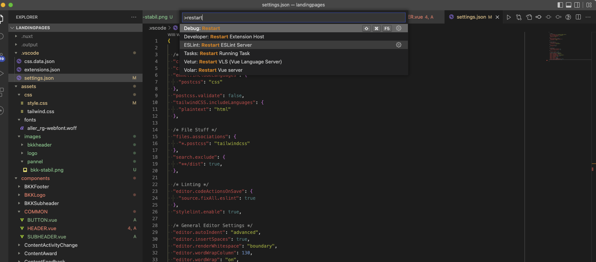
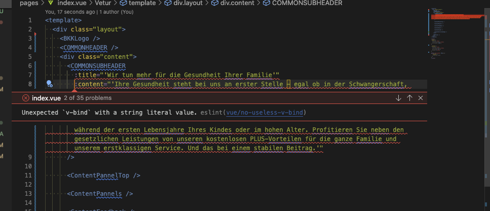

1. resets Route: cmd+p => >restart ESLint Server


2. Fehler

不给v-bind传字面量的字符要传递变量的字符串，或者不用：

# assets 文件夹  
<https://nuxtjs.org/docs/directory-structure/assets>
## images

在您的 vue 模板中，如果您需要链接到您的 assets 目录，请~/assets/your_image.png在资产前使用斜杠。
```
<template>
  
</template>
```

在您的 css 文件中，如果您需要引用您的  assets  目录，请使用~assets/your_image.png（不带斜线）
```
background: url('~assets/banner.svg');
```
使用动态图像时，您需要使用 require
```

```

## Fonts

```
@font-face {
  font-family: 'DM Sans';
  font-style: normal;
  font-weight: 400;
  font-display: swap;
  src: url('~assets/fonts/DMSans-Regular.ttf') format('truetype');
}

@font-face {
  font-family: 'DM Sans';
  font-style: normal;
  font-weight: 700;
  font-display: swap;
  src: url('~assets/fonts/DMSans-Bold.ttf') format('truetype');
}
```
external resources
<https://nuxtjs.org/docs/features/meta-tags-seo#external-resources>


