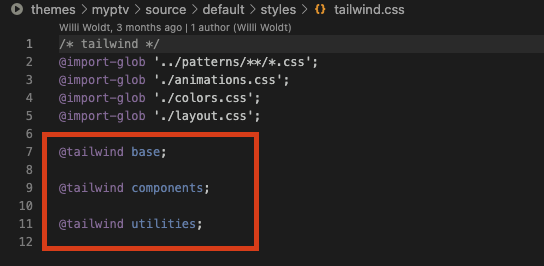

# Installation
1. Install tailwindcss via npm, and create your tailwind.config.js file.
```
npm install -D tailwindcss
npx tailwindcss init
```
2. Configure your template paths: tailwind.config.js 配置模板路径
```
module.exports = {
  content: ["./src/**/*.{html,js}"],
  theme: {
    extend: {},
  },
  plugins: [],
}
```
3. Add the Tailwind directives to your CSS  将 Tailwind 指令添加到您的 CSS
```
@tailwind base;
@tailwind components;
@tailwind utilities;
```
4. Start the Tailwind CLI build process
```
npx tailwindcss -i ./src/input.css -o ./dist/output.css --watch
```
5. Start using Tailwind in your HTML
```
<!doctype html>
<html>
<head>
  <meta charset="UTF-8">
  <meta name="viewport" content="width=device-width, initial-scale=1.0">
  <link href="/dist/output.css" rel="stylesheet">
</head>
<body>
  <h1 class="text-3xl font-bold underline">
    Hello world!
  </h1>
</body>
</html>
```
# Using with Preprocessors
npm install -D postcss-import  

```
// postcss.config.js
module.exports = {
  plugins: {
    'postcss-import': {},
    tailwindcss: {},
    autoprefixer: {},
  }
}
```

# Core Concepts
### Utility-First Fundamentals
```
<div class="chat-notification">
  <div class="chat-notification-logo-wrapper">
    
  </div>
  <div class="chat-notification-content">
    <h4 class="chat-notification-title">ChitChat</h4>
    <p class="chat-notification-message">You have a new message!</p>
  </div>
</div>

<style>
  .chat-notification {
    display: flex;
    max-width: 24rem;
    margin: 0 auto;
    padding: 1.5rem;
    border-radius: 0.5rem;
    background-color: #fff;
    box-shadow: 0 20px 25px -5px rgba(0, 0, 0, 0.1), 0 10px 10px -5px rgba(0, 0, 0, 0.04);
  }
  .chat-notification-logo-wrapper {
    flex-shrink: 0;
  }
  .chat-notification-logo {
    height: 3rem;
    width: 3rem;
  }
  .chat-notification-content {
    margin-left: 1.5rem;
    padding-top: 0.25rem;
  }
  .chat-notification-title {
    color: #1a202c;
    font-size: 1.25rem;
    line-height: 1.25;
  }
  .chat-notification-message {
    color: #718096;
    font-size: 1rem;
    line-height: 1.5;
  }
</style>
```


# Fragen:

1. #17 Wo liegt die Anweisungen?  
source/default/styles/tailwind.css

    

2. #27 Wo liegt HTML Datei?    

    #34   <link href="/dist/output.css" rel="stylesheet">. 
    ist das tailwind datei?


