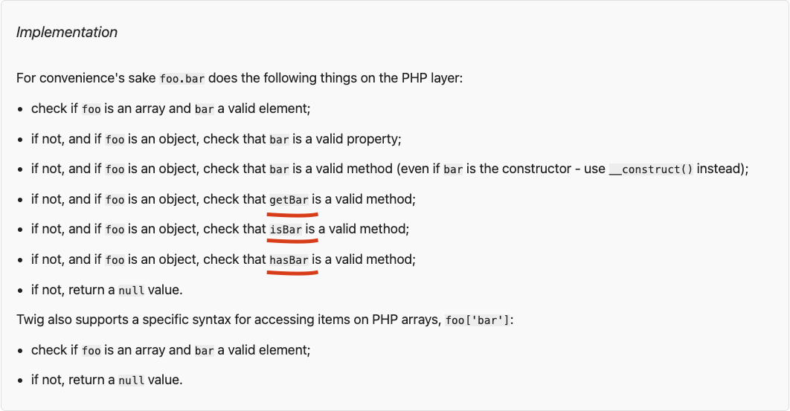
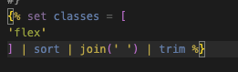
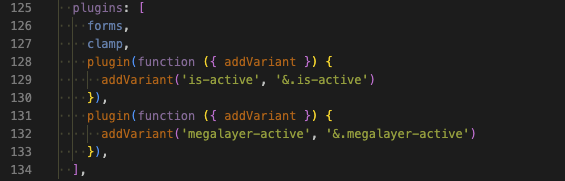
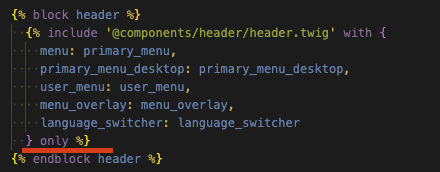

# Twig Syntax
template engine for PHP
- Fast
- Secure
- Flexible
## Installation
```twig
composer require "twig/twig:^3.0"
```

## Synopsis
A template contains variables or expressions
-  is used to execute statements such as for-loops 动作
- {{ ... }} is the result of an expression 打印一些东西
- {# ... #} comment something 
```twig
<!DOCTYPE html>
<html>
    <head>
        <title>My Webpage</title>
    </head>
    <body>
        <ul id="navigation">
        
            <li><a href="{{ item.href }}">{{ item.caption }}</a></li>
        
        </ul>

        <h1>My Webpage</h1>
        {{ a_variable }}
    </body>
</html>
```
集成开发环境 IDE： Visual Studio Code   
  

## Variables

```twig
{{ foo.bar }} //Variables
```
### Global Variables
_self: references the current template name;  引用当前模板名称；

_context: references the current context;  引用当前上下文；

_charset: references the current charset.  引用当前字符集。

### Setting Variables 设置变量
```



```

## Filters
变量可以通过过滤器进行修改。过滤器通过管道符号 (|) 与变量隔开。
```twig
{{ name|striptags|title }} // removes all HTML tags from the name and title-cases
```
```twig
{{ list|join(', ') }} //
接受参数的过滤器在参数周围有括号。此示例通过逗号连接列表的元素
```
```twig

    This text becomes uppercase

//要对一段代码应用过滤器，请使用 apply 标记对其进行包装
```

## Functions
```twig

    {{ i }},

```

## Named Arguments 命名参数
```twig

    {{ i }},

```

## Control Structure
```

    <ul>
        
            <li>{{ user.username|e }}</li>
        
    </ul>

```
## Template Inheritance
```
<!DOCTYPE html>
<html>
    <head>
        
            <link rel="stylesheet" href="style.css"/>
            <title> - My Webpage</title>
        
    </head>
    <body>
        <div id="content"></div>
        <div id="footer">
            
                &copy; Copyright 2011 by <a href="http://domain.invalid/">you</a>.
            
        </div>
    </body>
</html>
```

## Comparisons
```





```

## Containment Operator
```

```

## Test Operator
```
{{ name is odd }}
```

## Other Operators
|: Applies a filter.  

..: Creates a sequence based on the operand before and after the operator
```
{{ 1..5 }}
```
~: Converts all operands into strings and concatenates them. {{ "Hello
" ~ name ~ "!" }} would return (assuming name is 'John') Hello
John!.
., []: Gets an attribute of a variable.
?:: The ternary operator:
```
{{ foo ? 'yes' : 'no' }}
{{ foo ?: 'no' }} is the same as {{ foo ? foo : 'no' }}
{{ foo ? 'yes' }} is the same as {{ foo ? 'yes' : '' }}
```

??: The null-coalescing operator:

{# returns the value of foo if it is defined and not null, 'no' otherwise #}
```
{{ foo ?? 'no' }}
```
## Tags
### embed 嵌入
Embed 标签结合了 Include 和 Extends 的行为。它允许您包含另一个模板的内容，就像 Include 一样。但它也允许您覆盖包含的模板中定义的任何块，例如扩展模板。
将嵌入式模板视为“微布局骨架”。
```twig

    {# These blocks are defined in "teasers_skeleton.twig" #}
    {# and we override them right here:                    #}
    
        Some content for the left teaser box
    
    
        Some content for the right teaser box
    

```


Frage:
1. Muss ich erste Twig installieren? Drupal
2. Wir benutzen Drupal8(twig1) oder 9(twig2)? 9
3. #40 wie Vue? Daten wurden von Backend kommen?
4. implementation: Wo kommt getBar, isBar, hasBar? Sind sie PHP?  

    <https://twig.symfony.com/doc/3.x/templates.html>
    
5.  sort ist nach Alphabate sortiert
    
6. tailwind.config.js  

    remCalc(4) bedeutet ?  

    
7. Was bedeutet is-active und megalayer-active?
    
8. Wo kann man margin-bottom lesen?
    ) %}  //module  

    {# Classes #}  :class 动态样式

      
     <Script>
        data() {
        return {
            meta:{
                
            }
            }
        }
    </Script>
------------------------------------------

wie Vue Component  
include wie import {} from ' '
```
<script>
import ButtonCounter from './ButtonCounter.vue'

export default {
  components: {
    ButtonCounter
  }
}
</script>

<template>
  <ButtonCounter />
</template>
```
10. teaser #19: wo kommt 'basic-teaser group',
11. @apply ich benutze die Tempelate  
    @layer selber style definieren
12. only funktion    
 
包含模板时，它可以访问包含模板中可用的所有变量。如果出于某种原因您不希望这样做，请使用only关键字。

当我需要它时，我没有遇到过这种情况，但除了性能之外，可能还有其他原因。例如，您可以在某些情况下使用它来避免命名冲突。
Frage: 
1. Drupal.md #15 welche sprache?
2. Welche Funktion ist das .jsx Datei? React 