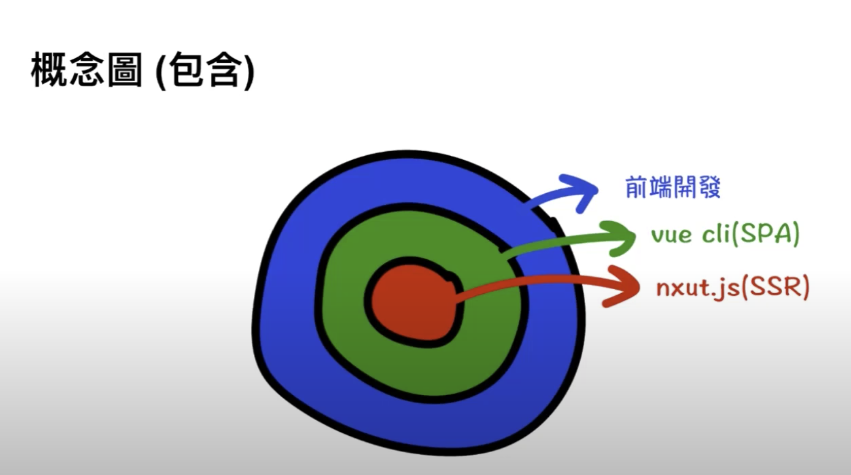
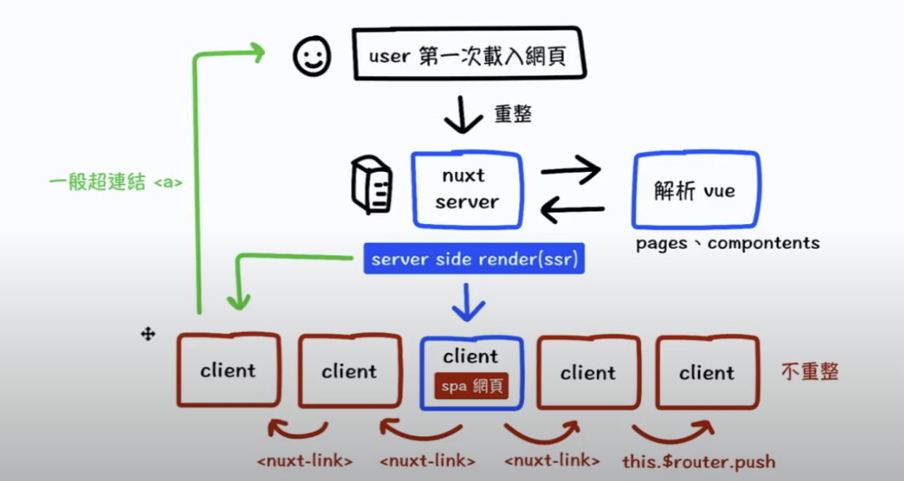
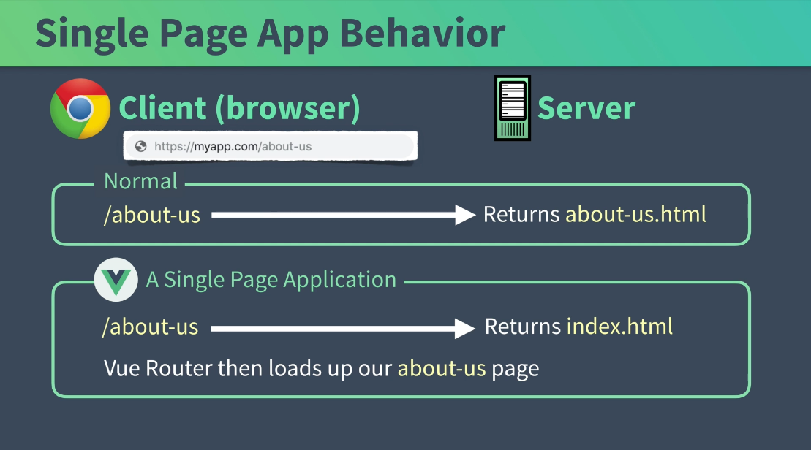
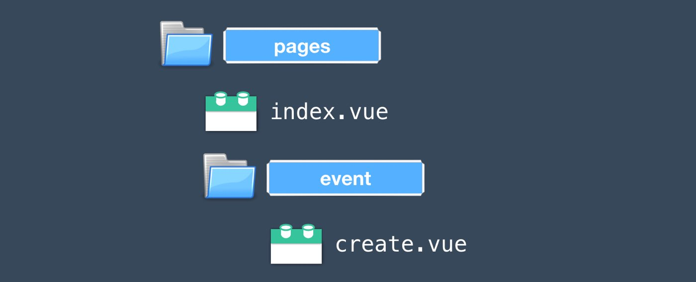
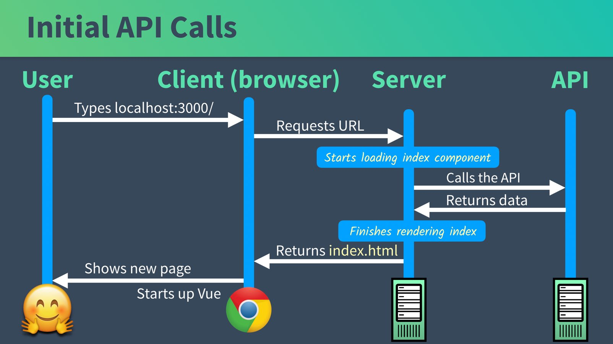
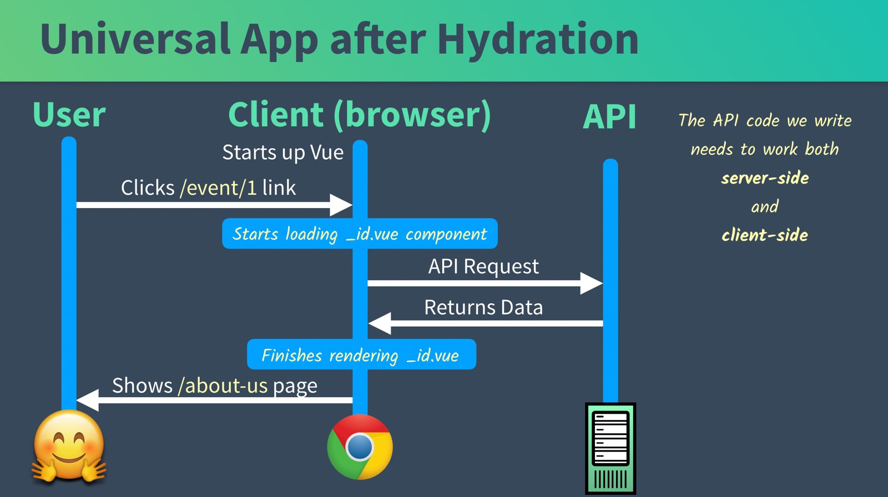

# Nuxt
## Was ist Nuxt? SSR
vue cli(SAP). 
nuxt.js(SSR) 

 

Server
 

## Warum Nuxt?
weniger Zeit mit der Konfiguration verbringen und mehr Zeit mit Problemen lösen und Projekte erstellen.
1. Einfach: mit Vuex, Vue Router und Vue-meta vorkonfiguriert; Viele intelligenten Standardeinstellungen
2. Vue-Router automatisch generieren
3. Keine Standardmethode, um alles zusammen zu konfigurieren
4. SEO freundlich: vorkonfiguriert wird
5. Routen werden bei Bedarf geladen

## Universal Mode
### SPAs Problem
Normal Site: Ein Browser muss viel können:
-  index.html herunterladen
- Vue-Anwendungs-JavaScript herunterladen
- Vue-App initialisieren
- Vue Router initialisieren und an die richtigen Komponenten weiterleiten
- alle zusätzlichen API-Aufrufe, um Daten zum Rendern abzurufen
- Vorlagen auf der Seite rendern  

Einmal geladen und ausgeführte Einzelseitenanwendungen wie diese sind ziemlich schnell, das anfängliche Laden kann jedoch langsam sein.  


### Universal Mode
- page.com/create anfragen
- Requests URL
- Page rendert alle static .HTML und benötige API
- show page.com/create befor Vue geloadet wird
- JS File anfragen
- JS zurückkehren
- Vue starten  
- Code Splitting
- nach initial Load und Code Splitting wird es wie nomale SPA
das heißt Hydration(verhält sich wie SPA)
## SEO mit vue-meta

### SPAs gibt es ein paar Probleme:

- Such-Crawler unterstützen möglicherweise keine neueren JavaScript-Funktionen.
- Google ist die einzige Engine, die versucht, JavaScript zu rendern.
- Ein JavaScript-Fehler kann dazu führen, dass Ihre gesamte Website nicht indexiert wird.
- Wenn Ihre Seite zu langsam ist, wird sie möglicherweise überhaupt nicht indiziert.
- Von Clients gerenderte JS-Websites haben in der Vergangenheit keinen hohen Stellenwert.

### SEO hinzufügen
 
### SEO Template   
/layout/default.vue
```vue
export default {
      head: {
        titleTemplate: '%s - Real World Events', // <-- title template
        meta: [
          {
            hid: 'description',
            name: 'description',  // <-- moved this over from index.vue
            content:
              'Where you can find all the events taking place in your neighborhood'
          }
        ]
      },
```
mehr über Vueßmeta  
https://vue-meta.nuxtjs.org/
## Router
### Verschachtelte Routen

### /.nuxt/router.js
   ...
        routes: [{
          path: "/event/create",
          component: _2a60c538,
          name: "event-create"
        },
    ... 
### Nuxt Dynamische Routen
#### 📜/pages/event/_id.vue
```
 <template>
      <div>
        <h1>Individual Event: {{ this.$route.params.id }}</h1>
      </div>
</template>
```
### SEO Dynamische Routen
```
  <template>
      <div>
        <h1>Event #{{ id }}</h1>
      </div>
    </template>
    <script>
    export default {
      head() {
        return {
          title: 'Event #' + this.id,
          meta: [
            {
              hid: 'description',
              name: 'description',
              content: 'What you need to know about Event #' + this.id
            }
          ]
        }
      },
      computed: {
        id() {
          return this.$route.params.id
        }
      }
    }
    </script>
```
### 创建我们自己的错误页面
https://github.com/nuxt/nuxt.js/blob/dev/packages/vue-app/template/components/nuxt-error.vue
####  /layouts/error.vue
```
 <template>
      <div>
        <svg xmlns="http://www.w3.org/2000/svg" width="90" height="90" fill="#DBE1EC" viewBox="0 0 48 48">
          <path d="M22 30h4v4h-4zm0-16h4v12h-4zm1.99-10C12.94 4 4 12.95 4 24s8.94 20 19.99 20S44 35.05 44 24 35.04 4 23.99 4zM24 40c-8.84 0-16-7.16-16-16S15.16 8 24 8s16 7.16 16 16-7.16 16-16 16z" />
        </svg>
        <div class="title">
          {{ message }} 
        </div>
        <p v-if="statusCode === 404">
          <nuxt-link to="/">
            Return to homepage
          </nuxt-link>
        </p>
      </div>
    </template>
    <script>
    export default {
      name: 'NuxtError',
      props: {
        error: {  // <--- Send in the error
          type: Object,
          default: null
        }
      },
      head() {
        return {
          title: this.message // <--- Set the SEO title
        }
      },
      computed: {
        statusCode() {  // <--- Get the status code
          return (this.error && this.error.statusCode) || 500
        },
        message() {  // <--- Print the error
          return this.error.message
        }
      }
    }
    </script>
```
## API-Aufrufe mit Axios

### 调用 API 的位置: 初始加载时

一旦启动 Vue，API 调用就开始从客户端发出。


### 设置：我们应用的模拟 API
